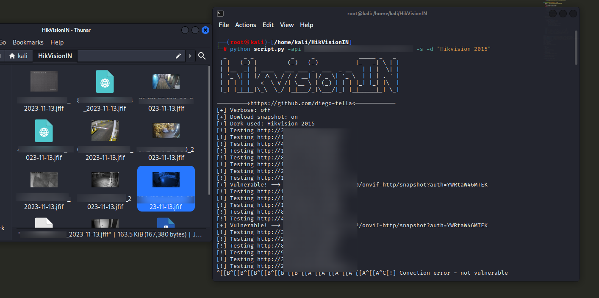

# HikvisionIN
A python script that look for hikvision vulnerable cams with a backdoor.

Using a valid shodan API key, this script will search for IPs on the internet, using a dork to find HikVision cameras. Once found, it will test to check if it is vulnerable to a backdoor.


<h1>Install</h1>

```
git clone https://github.com/diego-tella/HikvisionIN/
cd HikvisionIN
pip install shodan
python script.py
```

<h1>Usage</h1>

```
usage: script.py [-h] [-d DORK] [-s] [-v] -api APITOKEN
```
`-d` to define a custom dork.<br>
`-s` to save snapshots from vulnerable cams.<br>
`-v` verbose mode.<br>
`-api` your Shodan API token.<br>
`-h` help menu.<br>
<h2>Example:</h2>

```
python script.py -d "Hikvision 2015" -v -s -api API_TOKEN
```
